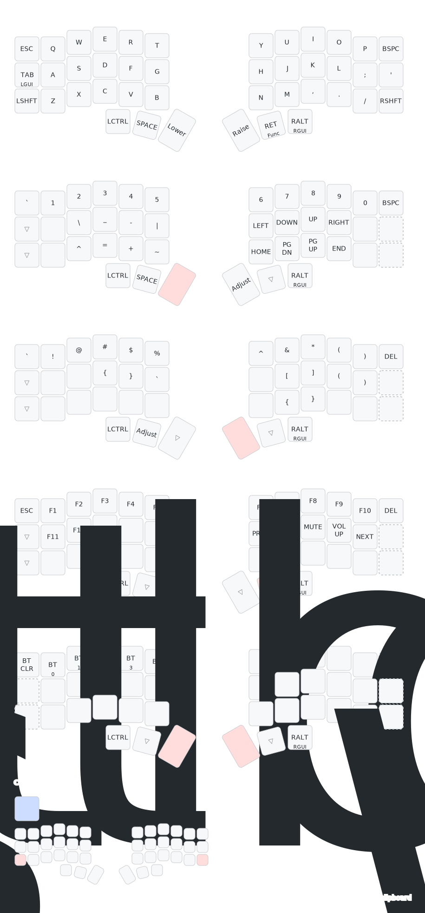

# Budget Wireless Corne Keyboard Build

A DIY wireless split keyboard based on the Corne layout, built for approximately $25 USD. This project uses a ProMicro clone with nrf52840 chip, making it a cost-effective alternative to traditional wireless split keyboard builds.

## Features
- Fully wireless using Bluetooth
- Split ergonomic design (Corne layout)
- Low profile design for portability
- Battery-powered with power switch
- ZMK firmware
- Estimated battery life: 1+ month

## Bill of Materials

| Component | Quantity | Cost (USD) | Link |
|-----------|----------|------------|------|
| Controller boards (ProMicro nrf52840) | 2 | 6.82 | [AliExpress](https://a.aliexpress.com/_EIV3vwY) |
| Batteries | 2 | 4.20 | [AliExpress](https://a.aliexpress.com/_Eynt9TK) |
| Mechanical Switches | 50 | 7.47 | [AliExpress](https://a.aliexpress.com/_EGhMxEC) |
| Keycaps | Set | 3.79 | [Option 1](https://a.aliexpress.com/_EzQyNtA) / [Option 2](https://a.aliexpress.com/_EH8mNqs) |
| Diodes (1N4148) | 100 | 0.85 | [AliExpress](https://a.aliexpress.com/_EwZoG2G) |
| Slide Switches | 2 | 0.11 | |
| 3D Printed Parts | Set | 1.80 | Files provided |

**Total Cost**: $25.04 (excluding wires and screws)

## Current Keymap

Current layout is a Corne port of the Canorus/do42 `brokenaxe` QWERTY layout:
- [Canorus/do42 repo](/Users/lkollar/src/tries/2026-03-21-Canorus-do42-do52/keymaps/brokenaxe/keymap.c)

Main goals:
- use all 6 cols on Corne
- keep layer roles close to Canorus
- keep board switching cheap mentally

Notable Corne-specific compressions:
- `TAB` is `LGUI` on hold
- right thumb outer is `RALT` on tap, `RGUI` on hold
- `ENTER` is `FUNC` on hold

Generated local keymap diagram:



Regenerate with:

```bash
./scripts/render_keymap.sh
```

Local keymap entry point:
- [config/corne.keymap](config/corne.keymap)

### Bootloader key

- Use hardware reset for reliability on split boards:
- short `RST` to `GND` twice

## Build Instructions

### Prerequisites
- Basic soldering skills
- Access to a 3D printer
- Basic understanding of keyboard firmware

### Case Assembly
1. Print the case files (STL files provided in `3DFiles` directory)
2. Note: You may need to adjust the:
   - Battery compartment size
   - Slide switch holes

### Wiring
1. Wire switches in a matrix configuration
2. Connect diodes:
   - Direction matters (black line indicates cathode)
   - Use diode legs for the rows
   - Use separate wires for columns
3. Keep wiring clear of screw holes
4. Connect the battery:
   - GND to GND pin
   - Positive to one of the side legs on the slide switch
   - Middle pin of the slide switch to the RAW pin

### Pin Connections for Rows and Columns
The matrix configuration uses GPIO pins on the nRF52840 Pro Micro clone. Below are the connections:


#### How Rows and Columns Are Numbered

- **Rows**: Rows are always numbered from top to bottom on both halves.
- **Columns**: Columns are always numbered from left to right (as viewed from the back of the plate (where the wiring is done)).

⚠️ **Note**: If you accidentally solder the rows or columns to the wrong pins, you do not need to desolder. The mappings can be fixed in the firmware configuration files:
- `corne.dtsi`: Defines rows for both halves.
- `corne_left.overlay`: Defines columns for the left half.
- `corne_right.overlay`: Defines columns for the right half.

#### Left Half Pin Assignments
- **Rows (Connected to `row-gpios`)**:
  - Row 0: `P0.31`
  - Row 1: `P1.13`
  - Row 2: `P0.02`
  - Row 3: `P1.15`
- **Columns (Connected to `col-gpios`)**:
  - Column 0: `P0.17`
  - Column 1: `P0.11`
  - Column 2: `P0.24`
  - Column 3: `P1.00`
  - Column 4: `P0.22`
  - Column 5: `P1.06`

#### Right Half Pin Assignments
- **Rows (`row-gpios`)**:
  - Row 0: `P0.31`
  - Row 1: `P0.29`
  - Row 2: `P0.02`
  - Row 3: `P1.15`
- **Columns (`col-gpios`)**:
  - Column 0: `P0.20`
  - Column 1: `P0.22`
  - Column 2: `P0.24`
  - Column 3: `P1.00`
  - Column 4: `P0.11`
  - Column 5: `P0.17`

### Firmware Setup
This keyboard uses ZMK firmware. The left half acts as the main controller that connects to your device.

To flash the firmware:
1. Double press the reset button
2. Board will appear as mass storage device
3. Flash the appropriate firmware file

If you forgot the keyboard from your device and can't reconnect:
1. Flash the `settings_reset-nice_nano_v2-zmk.uf2` file
2. Reflash the regular firmware
3. Pair

## Repository Structure
```
├── .github/workflows/
│   └── build.yml
├── 3DFiles/
│   ├── STEP/
│   │   └── CorneSTEP.step
│   ├── STL/
│   │   ├── Case_Left.stl
│   │   ├── Case_Right.stl
│   │   └── PlateCorne.stl
├── config/
│   ├── boards/shields/corne/
│   │   ├── corne_left.conf
│   │   ├── corne_left.overlay
│   │   ├── corne_right.conf
│   │   ├── corne_right.overlay
│   │   ├── corne.conf
│   │   ├── corne.dtsi
│   │   ├── Kconfig.defconfig
│   │   └── Kconfig.shield
│   ├── corne.keymap
│   └── west.yml
├── firmware/
│   ├── corne_left-nice_nano_v2-zmk.uf2
│   ├── corne_right-nice_nano_v2-zmk.uf2
│   └── settings_reset-nice_nano_v2-zmk.uf2
└── zephyr/
    ├── module.yml
    └── build.yaml
```

## Known Issues
- Left side case may have warping issues if battery swells
- Slide switch holes may need adjustment based on your components

## Final result


